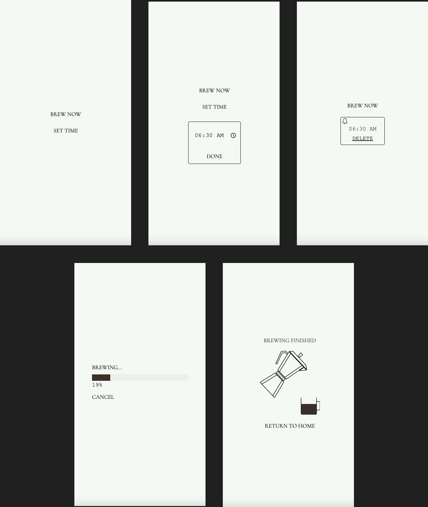

# Coffee Machine

*An automatic, IoT, chemistry-style pour-over coffee maker*

Inspired by a similar product seen in an Icelandic design store, this coffee maker uses a hot plate to heat water in a corked conical flask. Pressure from the steam forces water out of the tube and up and out to pour over the coffee filter resting in a funnel.

The machine uses a Raspberry Pi 3 hosting a web server for user interaction, which controls a relay connected to the hot plate.

The backend of the server is built in Python with Flask/WTForms/SQLite, and the frontend is rendered through Flask Jinja templates with the UIKit CSS framework and vanilla JavaScript.

A time is input via a time selector form element then passed to the backend. There, it is processed and stored in an SQL database. A scheduler is initiated to turn on the Raspberry Pi GPIO pin attached to the relay controlling the hot plate. The frontend can then query the API about the stored time and render a progress bar and various other pages.

